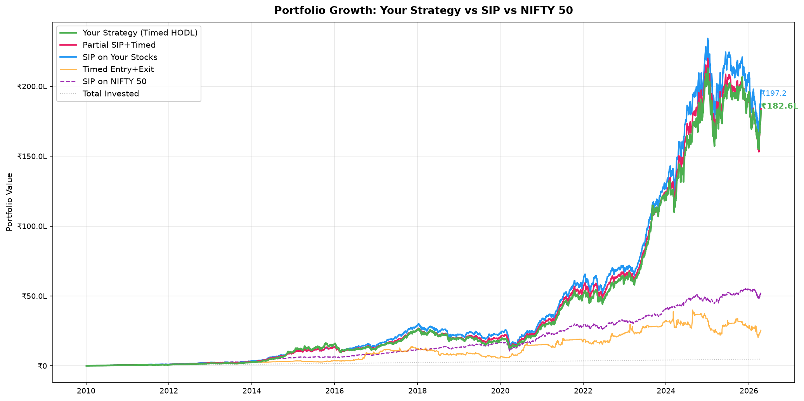
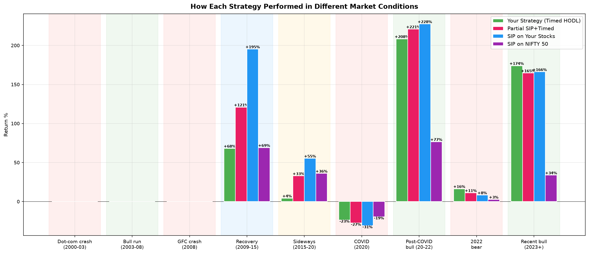

# Dip Mafia: Crash-Buy Signals for Indian Equities (NSE)

**Dip Mafia** (formerly HODL-bot) is an automated **algo-trading signal system** that identifies deeply undervalued stocks during market crashes using **200-period Bollinger Bands** and **dual MACD crossovers**, then delivers actionable buy signals with market sentiment to Telegram, fully automated via GitHub Actions.

> **Philosophy**: Buy the crash, hold forever. This bot watches 70+ fundamentally screened NSE stocks and alerts when they hit statistically extreme lows with confirmed momentum reversal. No day-trading, no exits, just long entries at high-conviction dips.
>
> **We never sell.** Sell / red signals are **indications only**: they flag technical weakness for awareness; Dip Mafia does not execute exits. The strategy is buy dips and HODL.
>
> The watchlist in `stocks.txt` is curated via a separate fundamental analysis tool (not included in this repo), this bot handles the technical timing layer on top of that fundamental filter.

### [Join the Telegram channel to receive live signals](https://t.me/dipmafia)

---

## How It Works

```
┌─────────────────────────────────────┐
│         stocks.txt (watchlist)      │
└──────────────┬──────────────────────┘
               ▼
┌─────────────────────────────────────┐
│     yfinance, 1yr daily OHLCV     │
└──────────────┬──────────────────────┘
               ▼
┌─────────────────────────────────────┐
│  Bollinger Bands (200-period, 2σ)  │
│  ┌─────┐  ┌───────┐  ┌──────┐     │
│  │ Buy │  │ Watch │  │ Hold │     │
│  └──┬──┘  └───┬───┘  └──┬───┘     │
│     │         │         │ filtered │
│     ▼         ▼         ✗ out     │
│  ┌─────────────────┐              │
│  │   MACD Filter   │              │
│  │  Standard 12/26 │              │
│  │  Impulse MACD   │              │
│  └────────┬────────┘              │
└───────────┼────────────────────────┘
            ▼
┌─────────────────────────────────────┐
│  Sentiment (Hold/Wait for Buy %)   │
│  Bullish · Neutral · Cautious ·    │
│  Bearish                           │
└──────────────┬──────────────────────┘
               ▼
┌─────────────────────────────────────┐
│     Telegram (if signals changed)  │
└─────────────────────────────────────┘
```

### Signal Logic

| Stage | Indicator | Signal | Meaning |
|---|---|---|---|
| **Gate** | Bollinger Bands (200, 2σ) | Buy | Price at or below lower band today |
| | | Watch | Touched lower band in last 60 days |
| | | Hold | No recent lower band interaction, **filtered out** |
| **Signal** | Standard MACD (12/26/9) | Buy/Sell | Crossover on current bar |
| | Impulse MACD (LazyBear) | Buy/Sell | SMMA + ZLEMA crossover on current bar |
| | Both | Hold / Wait for Buy | Between crossovers |
| **Context** | NIFTY 50 + Midcap 100 | % move, % from ATH | Market-wide context |
| **Sentiment** | Hold vs Wait ratio | Bullish/Neutral/Cautious/Bearish | Aggregate market mood |

### Deduplication

Signals are hashed each run. If unchanged from the previous run, Telegram notifications are skipped, no spam during sideways markets.

## Sample Output

```
📊 Signal Alert | 19 April, 03:15PM
🔻 NIFTY 50: -3.42% (from ATH: -18.50%)
🔻 NIFTY Midcap 100: -4.10% (from ATH: -25.30%)
🔴 Sentiment: Bearish

🔵 STANDARD MACD:
⏱️ 1d
🟢 SUZLON      ₹38.50
🟢 GRSE        ₹1850.00

📈 Summary:
🟣 Wait for Buy: 25/34 (73.5%)
🟡 Hold: 7/34 (20.6%)

🟠 IMPULSE MACD (LazyBear):
⏱️ 1d Impulse MACD
🟢 SUZLON      ₹38.50
🟢 GRSE        ₹1850.00
🟢 AIIL        ₹320.00

📈 Summary:
🟣 Wait for Buy: 28/34 (82.4%)
🟡 Hold: 4/34 (11.8%)
```

## Quick Start

### 1. Fork & configure secrets

Go to **Settings > Secrets and variables > Actions** and add:

| Secret | Value |
|---|---|
| `TELEGRAM_TOKEN` | Your bot token from [@BotFather](https://t.me/BotFather) |
| `TELEGRAM_CHAT_IDS` | Comma-separated chat IDs |

### 2. Edit your watchlist

`stocks.txt`, one NSE symbol per line, without `.NS`:
```
RELIANCE
TCS
INFY
```

### 3. Done

The bot runs automatically:
- **Weekdays**: every hour, 9:15 AM – 3:15 PM IST (market hours)
- **Weekends**: once at 10:15 AM IST

Or trigger manually: **Actions tab → Run workflow**

### Local run

```bash
pip install -r requirements.txt
export TELEGRAM_TOKEN="your_token"
export TELEGRAM_CHAT_IDS="id1,id2"
python bot.py
```

## Backtest

A portfolio-level backtest validates the timing strategy against plain SIP investing. All stocks in `stocks.txt` share a single monthly budget, the point of 60+ stocks is that something is always dipping, keeping cash deployed.

### Run it

```bash
pip install matplotlib scipy  # one-time, in addition to requirements.txt
python3 backtest.py
```

Generates 8 charts in `backtest_output/` + console summary.

### Latest Results (73 stocks, 2010–2026)

> Run as of 2026-04-17 against the 75-symbol `stocks.txt` (73 had enough history for the 200-bar Bollinger warmup), with the expanded 60-bar Bollinger watch window. The previous 62-symbol / 30-bar run is archived under `backtest_output_archive_20260417/`.

```
════════════════════════════════════════════════════════════════════════════════════════════════════
  INVESTMENT ASSUMPTIONS
────────────────────────────────────────────────────────────────────────────────────────────────────
  Period:             2010-01-04 → 2026-04-17 (16.3 years)
  Starting salary:    ₹22,000/month → ₹101,089/month (10% annual hike)
  Monthly SIP:        ₹5,500 → ₹25,272 (25% of salary)
  Total invested:     ₹24.7L (inflation-adjusted: ₹9.6L in 2010 rupees)
  Inflation (6%/yr):  ₹1 in 2010 = ₹2.6 today

════════════════════════════════════════════════════════════════════════════════════════════════════
  RESULTS — 73 stocks, ₹24.7L invested
════════════════════════════════════════════════════════════════════════════════════════════════════
                            Your Strategy (Timed HODL)      Partial SIP+Timed     SIP on Your Stocks       Timed Entry+Exit        SIP on NIFTY 50
  ───────────────────────────────────────────────────────────────────────────────────────────────
  Final Value                              ₹182.6L                ₹184.1L                ₹197.2L                 ₹25.6L                 ₹52.3L
  Inflation-Adj Value                       ₹70.7L                 ₹71.3L                 ₹76.4L                  ₹9.9L                 ₹20.2L
  Wealth Multiple                             7.4x                   7.4x                   8.0x                   1.0x                   2.1x
  Real Multiple (infl-adj)                    2.9x                   2.9x                   3.1x                   0.4x                   0.8x
  XIRR                                       26.2%                  26.2%                  27.0%                   0.5%                  10.9%
  Real XIRR (minus 6% infl)                  20.2%                  20.2%                  21.0%                  -5.5%                   4.9%
  Sharpe                                      1.27                   1.30                   1.31                   0.90                   1.13
  Sortino                                     2.97                   3.10                   3.06                   1.96                   3.40
  Max Drawdown                              -52.4%                 -50.0%                 -51.4%                 -59.6%                 -37.3%
  Max DD Duration                         718 days               709 days               709 days               662 days               183 days
  Volatility                                 40.8%                  39.3%                  39.5%                  47.0%                  37.7%

  Buy signals fired on 165 days across 58/73 stocks
  Cash drag (Your Strategy): 5.7%
```

### Key Findings

| Metric | Your Strategy | SIP (same stocks) | NIFTY 50 SIP |
|---|---|---|---|
| Final Value | ₹183L | ₹197L | ₹52L |
| Inflation-Adjusted | ₹71L | ₹76L | ₹20L |
| XIRR | 26.2% | 27.0% | 10.9% |
| Real XIRR (−6% inflation) | **20.2%** | 21.0% | 4.9% |
| Sharpe | 1.27 | **1.31** | 1.13 |
| Sortino | 2.97 | 3.06 | 3.40 |
| Max Drawdown | **-52%** | -51% | -37% |
| Volatility | 40.8% | **39.5%** | 37.7% |

- **Both strategies crush NIFTY 50 by ~3.5x**, stock picking matters more than timing
- **Timed HODL and SIP are neck-and-neck on returns**, with similar max drawdown (-52% vs -51%) at this wider universe
- **Real returns beat inflation easily**, 20.2% real XIRR for Timed HODL vs 4.9% for NIFTY 50
- **Cash drag is only 5.7%**, 70+ stocks keep money deployed
- **Entry+Exit is terrible**, selling on MACD Sell destroys compounding

### Charts

| Chart | What it shows |
|---|---|
| `1_equity_curves.png` | All strategies + NIFTY 50 on one chart |
| `2_drawdowns.png` | How deep each strategy fell from peak |
| `3_cash_utilization.png` | % of money actually invested vs cash |
| `4_regime_returns.png` | Returns during bull, bear, sideways, recovery |
| `5_rolling_alpha.png` | When your strategy beats/loses to SIP |
| `6_buy_distribution.png` | Which stocks got bought most often |
| `7_buy_timeline.png` | When buys happened over time |
| `8_summary_table.png` | Full metrics table with best values highlighted |





## Architecture

```
├── bot.py                 # Orchestrator, Telegram sender, sentiment
├── macd_signals.py        # Standard + Impulse MACD (standalone capable)
├── bollinger_signals.py   # 200-period Bollinger Bands (standalone capable)
├── stocks.txt             # Watchlist
├── requirements.txt       # yfinance, requests
└── .github/workflows/
    └── dip-mafia.yml      # GitHub Actions (cron + cache)
```

Each signal module can run standalone for quick analysis:
```bash
python bollinger_signals.py   # Bollinger only
python macd_signals.py        # MACD only
```

## Configuration

| Parameter | File | Default |
|---|---|---|
| BB period | `bollinger_signals.py` | 200 |
| BB std dev | `bollinger_signals.py` | 2 |
| BB watch window | `bollinger_signals.py` | 60 bars |
| MACD fast/slow/signal | `macd_signals.py` | 12/26/9 |
| Impulse MA length | `macd_signals.py` | 34 |
| Impulse signal length | `macd_signals.py` | 9 |

## Disclaimer

This is not financial advice. The bot generates signals for educational and research purposes. Always do your own due diligence before making investment decisions.
