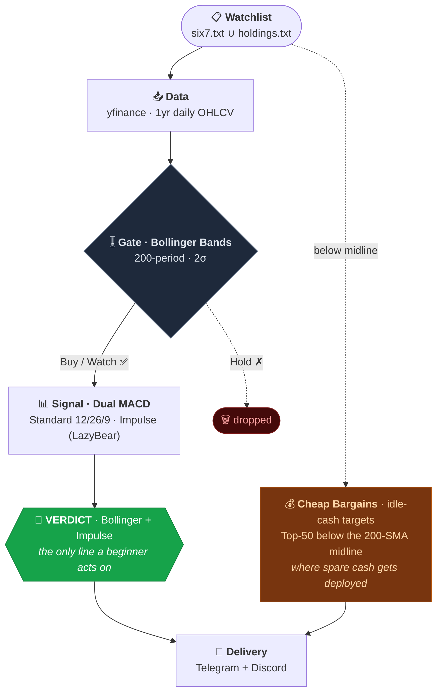
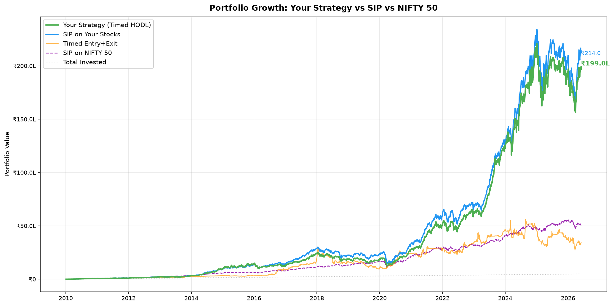
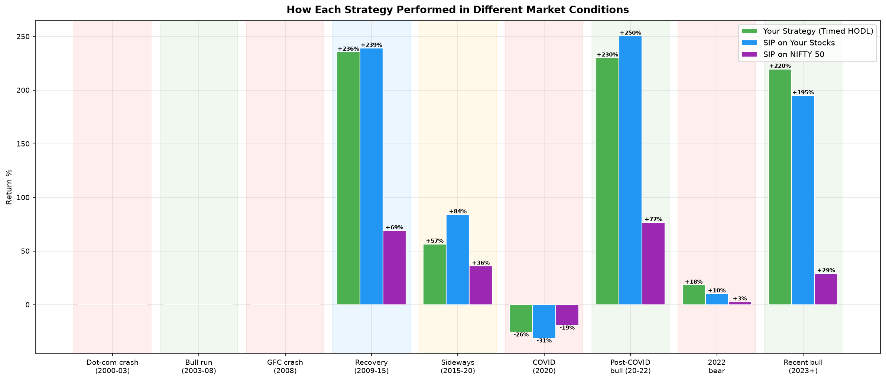
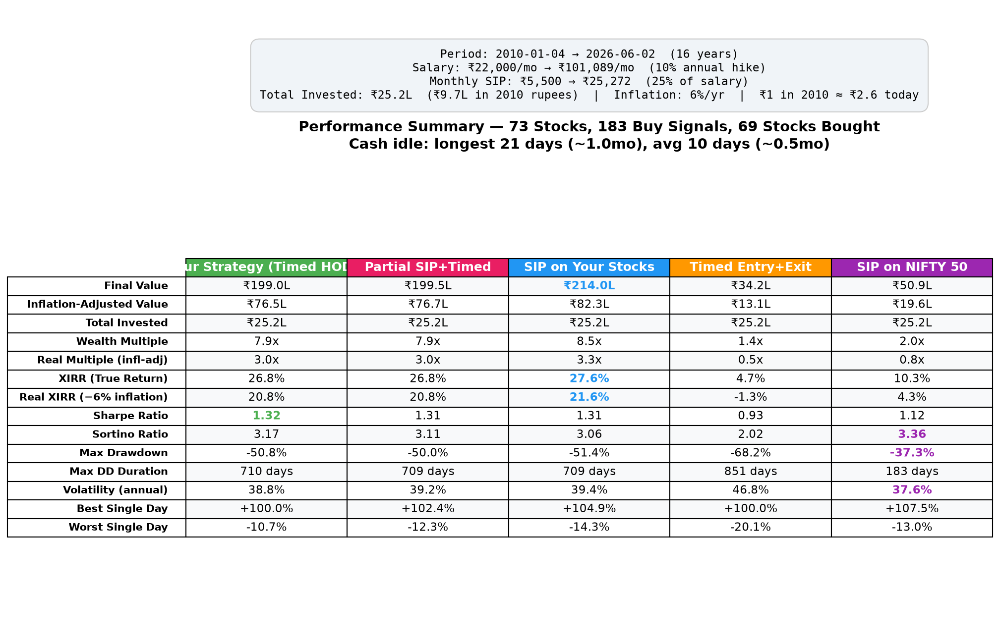

# Dip Mafia: Crash-Buy Signals for Indian Equities (NSE)

**Dip Mafia** (formerly HODL-bot) is an automated **algo-trading signal system** that identifies deeply undervalued stocks during market crashes using **200-period Bollinger Bands** and **dual MACD crossovers**, then delivers actionable buy signals with market sentiment to Telegram and Discord, fully automated via GitHub Actions.

> **Philosophy**: Buy the crash, hold forever. This bot watches 100+ NSE stocks (six7 Top 50 ∪ your real holdings) and alerts when they hit statistically extreme lows with confirmed momentum reversal. No day-trading, no exits, just long entries at high-conviction dips.
>
> **We never sell.** Sell / red signals are **indications only**: they flag technical weakness for awareness; Dip Mafia does not execute exits. The strategy is buy dips and HODL.
>
> The watchlist is the union of two lists: `six7.txt` (the six7 Top 50, curated by a separate fundamental scorer) and `holdings.txt` (the stocks already held). Signals fire on both, and each Telegram line is tagged `⭐` Top 50 or `💼` your holding, so a position you hold keeps getting signals even after the Top 50 rotates. This bot handles the technical timing layer on top of that fundamental filter.

### Join to receive live signals:
- 📨 [Telegram channel](https://t.me/dipmafia)
- 💬 [Discord server](https://discord.gg/qmYPPjPdGA)

---

## How It Works



### Signal Logic

| Stage | Indicator | Signal | Meaning |
|---|---|---|---|
| **Gate** | Bollinger Bands (200, 2σ) | Buy | Price at or below lower band today |
| | | Watch | Touched lower band in last 60 days |
| | | Hold | No recent lower band interaction, **filtered out** |
| | | _midline gate_ | Buy/Watch must also be below the 200-SMA midline. Live bot: `REQUIRE_CLOSE_BELOW_MIDLINE=True` (matches the backtest's `BUY_REQUIRE_BELOW_MID`). Set False to revert to the looser awareness view. |
| **Signal** | Standard MACD (12/26/9) | Buy/Sell | Crossover on current bar |
| | Impulse MACD (LazyBear) | Buy/Sell | SMMA + ZLEMA crossover on current bar |
| | Both | Hold / Wait for Buy | Between crossovers |
| **Context** | NIFTY 50 + Midcap 100 | % move, % from ATH | Market-wide context |
| **Sentiment** | Hold vs Wait ratio | Bullish/Neutral/Cautious/Bearish | Aggregate market mood |
| **Deploy** | Cheap Bargains (Top-50 vs 200-SMA) | idle-cash targets | Top-50 names trading below the 200-SMA midline, cheapest first, with `⚡` on a fresh Impulse MACD cross. This is **where spare cash goes**: cash left idle beyond ~21 days is spread equally across these below-midline names (capped 15% per name). Rendered as the `📉 Cheap Bargains` section. |

### Delivery cadence

Two trigger paths post the same full message to Telegram and Discord:

- **Scheduled cron** (`dip-mafia.yml`) - 4 runs/day on weekdays (~08:33 / 10:33 / 12:33 / 14:33 IST) plus a weekend summary on **both Saturday and Sunday** (~10:33 IST). (GitHub cron is best-effort, so these are targets, not guarantees; spreading the runs keeps coverage even if one is delayed or dropped.)
- **Scan-triggered** - the external six7 scan dispatches `dip-mafia.yml` on *every* scan, so a scan always posts once.

**Every run recomputes and posts fresh.** It re-reads current prices and rebuilds the whole message each time, so the prices, sentiment, and the mid-line / Cheap Bargains read are always current - there is no reuse cache (it was retired so intraday drift never shows stale data). A watchlist source-list change (`six7.txt` from the mirror, or a hand-synced `holdings.txt`) only rebuilds the derived `stocks.txt` via `regen-stocks.yml` - it **no longer posts directly**; the next scan or cron run covers it, which avoids double-posting. The `reuse_if_unchanged` workflow input still exists but is now ignored - a no-op kept only so the six7 dispatch (which still passes it) doesn't error.

## Sample Output

```
🩸 DIP MAFIA
19 Apr · 3:15 PM IST

🔻 NIFTY 50
Today -3.42%  ·  ATH -18.5%
🔻 MIDCAP 100
Today -4.10%  ·  ATH -25.3%

🔴 Sentiment: Bearish

🎯 Verdict (Boll + iMACD)
🟢 ⭐ ⏬ SUZLON  ₹38.50

🟣 Wait for Buy · 30/34 · 88.2%
🟡 Hold · 4/34 · 11.8%

──────────────────────────
📉 Cheap Bargains (Top 50 · below 200-SMA)
💰 cash in hand? grab these undervalued now
⏬ SUZLON  -12.4% ⚡
🔽 GRSE     -3.1%
🔽 KRBL     -1.8%

──────────────────────────
▶️ how to act
🟢 buy the 🎯 Verdict picks
💰 spare cash? spread across 📉 Cheap Bargains

ℹ️ legends
🟢 buy · 🔴 sell
⚡ iMACD turning up
⭐ Top 50 · 💼 your holding
⏬ deep dip · 🔽 undervalued
🔼 above avg · ⏫ overvalued

Dip Mafia never sells, red just flags weakness · we only buy dips & HODL
```

### New here? How to read it - and what to do

If the indicators, sentiment, and summary lines don't make sense, **skip them.** Two sections tell you what to do, and the `▶️ how to act` block at the bottom of every message sums them up:

**🎯 Verdict - what to buy.** The bot's highest-conviction call: a stock that's both deeply dipped (Bollinger) *and* turning up (Impulse MACD).
- **🟢 buy in the Verdict = the only line a beginner needs to act on.** That's "Dip Mafia thinks this is a good dip to buy." The example above is telling you to buy `SUZLON`.
- **`🚫 no buys today` under Verdict? Do nothing.** No action that run - that's normal, and most runs look like this.

**📉 Cheap Bargains - where idle cash goes.** Top-50 names trading below their 200-day average (the 200-SMA midline), cheapest first. If you have cash sitting idle, **this is where the strategy parks it** - spread it across these below-midline names rather than letting it rot. A `⚡` means momentum is already turning up on that name. (Same rule the backtest uses: cash idle beyond ~21 days is deployed equally across below-midline names, capped 15% per name.)

**🔴 red is never a sell.** Dip Mafia never sells. Red just flags technical weakness for awareness. You only ever buy dips and HODL.

The `🟡 Sentiment` line up top is the only extra context in the message - safe to skip. The raw per-stock MACD and Impulse MACD lists (the noisier, ungated reads) are **not** in the notification anymore; they live in full detail in the GitHub Action run log, alongside a `BOLLINGER FILTER PASS` list of exactly which stocks feed the Verdict.

## Quick Start

### 1. Fork & configure secrets

Go to **Settings > Secrets and variables > Actions** and add:

| Secret | Value |
|---|---|
| `TELEGRAM_TOKEN` | Your bot token from [@BotFather](https://t.me/BotFather) |
| `TELEGRAM_CHAT_IDS` | Comma-separated chat IDs |
| `DISCORD_WEBHOOK_URL` | _Optional_. Discord channel webhook (Server → Integrations → Webhooks → New Webhook → Copy URL). Posts mirror the Telegram payload with an `@here` ping. |

### 2. Edit your watchlist

The bot signals on the union of two files, one NSE symbol per line, without `.NS`:

- `six7.txt` - the Top 50 watchlist (overwritten by the external six7 mirror)
- `holdings.txt` - stocks you already hold (so they keep getting signals)

```
RELIANCE
TCS
INFY
```

`stocks.txt` is a **derived** file (the `six7.txt` ∪ `holdings.txt` union) used only by the backtest/dashboard tooling - regenerate it with `python3 watchlist.py` after editing either list.

### 3. Done

The bot runs automatically:
- **Weekdays**: 4 runs/day, ~08:33 / 10:33 / 12:33 / 14:33 IST (cron targets - GitHub may delay them)
- **Weekends**: one summary, ~10:33 IST

The external six7 scan also dispatches a run after each scan (re-sending the cached post when the watchlist and trading date are unchanged). Or trigger manually: **Actions tab → Run workflow**

### Local run

```bash
pip install -r requirements.txt
export TELEGRAM_TOKEN="your_token"
export TELEGRAM_CHAT_IDS="id1,id2"
python bot.py
```

## Backtest

A portfolio-level backtest validates the timing strategy against plain SIP investing. All stocks in `stocks.txt` share a single monthly budget - the point of 50+ stocks is that something is always dipping, keeping cash deployed.

### Run it

```bash
pip install matplotlib scipy  # one-time, in addition to requirements.txt
python3 analysis/backtest.py  # run from the repo root
```

Generates 8 charts in a dated run subfolder under `backtest_output/` + console summary.

### Latest Results (50 stocks, 2010–2026)

> Run as of 2026-04-17 against `six7.txt` alone - the **six7 Top 50** (highest 50 by 0-10 Fundamental Score, refreshed 2026-06-16 after the floor-0.5 financials scoring fix). 46 of 50 had enough history for the 200-bar Bollinger warmup. 60-bar watch window, **midline buy gate** (`REQUIRE_CLOSE_BELOW_MIDLINE = True` in `bot.py` and `BUY_REQUIRE_BELOW_MID = True` in `backtest.py` - aligned 2026-06-17), and the **V4 idle-cash fallback** (deploy after 21 idle days across any watchlist stock below its 200-SMA, force-deploy if none - see `notes/STRATEGY_COMPARISON.md`). The live bot signals on `six7.txt ∪ holdings.txt`; the strat backtest above isolates the six7 list so the headline reflects the curated fundamental screen, not the ~50 personal SME/illiquid names in `holdings.txt` that drag returns ~1pp.

```
════════════════════════════════════════════════════════════════════════════════════════════════════
  INVESTMENT ASSUMPTIONS
────────────────────────────────────────────────────────────────────────────────────────────────────
  Period:             2010-01-04 → 2026-04-17 (16.3 years)
  Starting salary:    ₹22,000/month → ₹101,089/month (10% annual hike)
  Monthly SIP:        ₹5,500 → ₹25,272 (25% of salary)
  Total invested:     ₹24.7L (inflation-adjusted: ₹9.6L in 2010 rupees)
  Inflation (6%/yr):  ₹1 in 2010 = ₹2.6 today

════════════════════════════════════════════════════════════════════════════════════════════════════
  RESULTS - 46 stocks, ₹24.7L invested
════════════════════════════════════════════════════════════════════════════════════════════════════
                            Your Strategy (Timed HODL)     SIP on Your Stocks       Timed Entry+Exit        SIP on NIFTY 50
  ───────────────────────────────────────────────────────────────────────────────────────────────
  Final Value                              ₹238.6L                ₹221.2L                 ₹76.3L                 ₹52.3L
  Inflation-Adj Value                       ₹92.4L                 ₹85.7L                 ₹29.5L                 ₹20.2L
  Wealth Multiple                             9.6x                   8.9x                   3.1x                   2.1x
  Real Multiple (infl-adj)                    3.7x                   3.4x                   1.2x                   0.8x
  XIRR                                       29.2%                  28.3%                  15.8%                  10.9%
  Real XIRR (minus 6% infl)                  23.2%                  22.3%                   9.8%                   4.9%
  Sharpe                                      1.38                   1.35                   1.06                   1.13
  Sortino                                     3.40                   3.41                   2.30                   3.40
  Max Drawdown                              -41.3%                 -45.0%                 -57.9%                 -37.3%
  Max DD Duration                         639 days               698 days               653 days               183 days
  Volatility                                 38.0%                  38.4%                  45.6%                  37.7%

  Buy signals fired on 181 days across 46/46 stocks
  Cash drag (Your Strategy): 1.3%   ·   longest idle: 21 trading days (~1 month)   ·   502 fallback buys
```

### Key Findings

| Metric | Your Strategy | SIP (same stocks) | NIFTY 50 SIP |
|---|---|---|---|
| Final Value | ₹239L | ₹221L | ₹52L |
| Inflation-Adjusted | ₹92L | ₹86L | ₹20L |
| XIRR | **29.2%** | 28.3% | 10.9% |
| Real XIRR (−6% inflation) | **23.2%** | 22.3% | 4.9% |
| Sharpe | **1.38** | 1.35 | 1.13 |
| Sortino | 3.40 | 3.41 | 3.40 |
| Max Drawdown | **-41%** | -45% | -37% |
| Volatility | 38.0% | 38.4% | 37.7% |

- **Both strategies crush NIFTY 50 by ~4.6x** - stock picking matters more than timing, and the six7 Top 50 sets the fundamental quality bar (every name is a Strong Buy).
- **Timed HODL edges SIP across the full run** (29.2% vs 28.3% XIRR) and stays ahead on every horizon ≥ 10y. Mid-horizons (3y/5y) are close - the midline gate suppresses buys during strong uptrends, where SIP just deploys monthly.
- **Drawdown is structurally better** - -41% vs SIP's -45% vs the union's -49%. Concentrating into the curated screen cuts tail risk.
- **Backtest gate and live bot gate are aligned** - both `BUY_REQUIRE_BELOW_MID` (backtest) and `REQUIRE_CLOSE_BELOW_MIDLINE` (bot) are True, so the Telegram + Discord posts drop Watch names that recovered above the 200-SMA. What you see is what the backtest would actually buy.
- **Cash drag low at 1.3%**, longest idle stretch 21 trading days, V4 fallback deploying across any below-midline name when signals dry up.
- **Real returns easily beat inflation** - 23.2% real XIRR for Timed HODL vs 4.9% for NIFTY 50.
- **Entry+Exit is worse than just holding** - XIRR 15.8% vs Timed HODL's 29.2%; selling on MACD Sell destroys compounding.

> The backtest is current-screen hindsight (today's Top 50 run backward - survivorship/look-ahead biased), so treat the levels as relative, not predictive.

### Returns by horizon (six7.txt alone)

The summary table above is the full ~16-year run. Recent trailing-window XIRR for the same 50-symbol list:

| Horizon | Timed HODL | SIP (same stocks) | NIFTY 50 |
|---|---|---|---|
| 1 year | **30.4%** | 18.3% | -4.6% |
| 3 years | **34.7%** | 32.4% | 4.2% |
| 5 years | 42.3% | **43.8%** | 7.5% |
| 10 years | **39.0%** | 37.9% | 10.9% |
| Full (~16y) | **29.1%** | 28.2% | 10.9% |

> Each horizon is a fresh windowed sim on the salary model (₹22k/mo from 2010, +10%/yr, 25% invested), calendar-anchored then restricted to the window. Timed HODL's edge concentrates in the recent down year (1y: NIFTY −4.6%, Timed +30.4% deploying into the dip) and over the long run; SIP narrowly wins the 5y window because the midline gate sat out a stretch of the post-2020 uptrend.

### Charts

| Chart | What it shows |
|---|---|
| `1_equity_curves.png` | All strategies + NIFTY 50 on one chart |
| `2_drawdowns.png` | How deep each strategy fell from peak |
| `3_cash_utilization.png` | % of money actually invested vs cash |
| `4_regime_returns.png` | Returns during bull, bear, sideways, recovery |
| `5_rolling_alpha.png` | When your strategy beats/loses to SIP |
| `6_buy_distribution.png` | Which stocks got bought most often |
| `7_buy_timeline.png` | When buys happened over time |
| `8_summary_table.png` | Full metrics table with best values highlighted |





## Architecture

```
├── bot.py                 # live entry: orchestrator, Telegram sender, sentiment
├── macd_signals.py        # Standard + Impulse MACD (standalone capable)
├── bollinger_signals.py   # 200-period Bollinger Bands (standalone capable)
├── watchlist.py           # two-list loader; regenerates stocks.txt
├── six7.txt               # source list: six7 Top 50 (mirror target)
├── holdings.txt           # source list: stocks you already hold
├── stocks.txt             # DERIVED union (six7 ∪ holdings); analysis input only
├── analysis/              # research/backtest tooling (run from the repo root)
│   ├── backtest.py        # portfolio backtest - Timed HODL (V4 fallback + midline + bb-60)
│   ├── horizon_compare.py # 1y/3y/5y/10y/Full horizon grids for the dashboard
│   ├── portfolio_view.py  # emits docs/strat_data.js (per-horizon portfolio books + backtest + iterations)
│   ├── backtest_six7.py   # six7 almanac: lists × horizons (same Timed HODL strategy)
│   ├── build_web.py       # assembles docs/data.js for the Screens section
│   └── run_paths.py       # backtest_output/ layout helper
├── pine/                  # TradingView ports (indicator + strategy)
├── notes/                 # STRATEGY_COMPARISON.md, context.md, specs/
├── tests/                 # test_bb_position.py, test_watchlist.py
├── backtest_output/       # dated run subfolders + six7/ almanac
├── docs/                  # GitHub Pages: index.html (unified dashboard) + data.js + strat_data.js
├── requirements.txt       # yfinance, requests
└── .github/workflows/
    ├── dip-mafia.yml      # cron + scan-dispatch; runs `python bot.py` (with last-post cache)
    └── regen-stocks.yml   # rebuilds derived stocks.txt when a source list changes (no posting)
```

Each signal module can run standalone for quick analysis:
```bash
python bollinger_signals.py   # Bollinger only
python macd_signals.py        # MACD only
```

## Configuration

| Parameter | File | Default |
|---|---|---|
| BB period | `bollinger_signals.py` | 200 |
| BB std dev | `bollinger_signals.py` | 2 |
| BB watch window | `bollinger_signals.py` | 60 bars |
| MACD fast/slow/signal | `macd_signals.py` | 12/26/9 |
| Impulse MA length | `macd_signals.py` | 34 |
| Impulse signal length | `macd_signals.py` | 9 |

## Disclaimer

This is not financial advice. The bot generates signals for educational and research purposes. Always do your own due diligence before making investment decisions.
